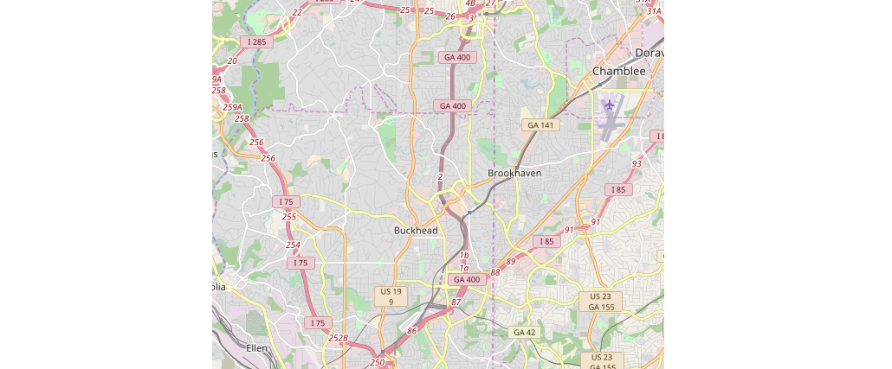

# Wrangling OpenStreetMap data with MongoDB

In this project, I downloaded data from [OpenStreetMap.org](http://www.openstreetmap.org) 
via the [Overpass API](http://overpass-api.de/query_form.html). 
I clean the data and wrangle it into JSON format as 
preparation for loading it into a NoSQL MongoDB database.
Here is the region I selected centered around Buckhead in Atlanta, GA:




## Data Quality and Cleaning

After downloading the OSM data for Atlanta/Buckhead, 
I encountered a few problems with the data as described below.

### Abbreviations throughout the street address

There is a lack of consistency with street name abbreviations that needs 
to be cleaned, such as "NE" vs "Northeast" or "Ave" vs "Avenue". 
I also noted that abbreviated street types were often throughout the string 
and not only at the very end.

My code corrected this many street types in the Atlanta dataset that I selected:

{'Northeast': 40, 'North': 1, 'Drive': 2, 'Southeast': 30, 'Street': 1, 
'Northwest': 40, 'Boulevard': 2, 'East': 3, 'Avenue': 33, 'Road': 36}

Most of the data were in general fairly clean. As a reference, there were this 
many street names that already fit the expected format:

{'Northeast': 16501, 'Court': 506, 'West': 650, 'Boulevard': 298, 
'Northwest': 13770, 'Way': 624, 'Suite': 1, 'Circle': 1160, 'East': 474, 
'Southwest': 3907, 'North': 1015, 'Southeast': 4229, 'Trail': 27, 'Road': 6264, 
'Lane': 292, 'Drive': 7445, 'Place': 1660, 'Parkway': 182, 'South': 28, 
'Square': 3, 'Street': 11529, 'Avenue': 7633}

### Inconsistencies within and between names and amenities

I noticed inconsistencies within the names and also within the amenities. 
As an example, both "Walgreens" and "Walgreen's" were names, so I corrected 
those entries to Walgreens after verifying the correct spelling. 
Also, the list of amenities has both "social_centre" and "social_center", 
so I made them match in my database.

I also took this analysis a step further by examining the *relationship* 
between names and amenities. I theorized that any particular name in the 
database should only have one amenity type. The analysis showed that there 
were a few names that had different amenity types:

* Taco Mac: restaurant, pub (Based on my knowledge of Taco Mac, should be all restaurant)
* Wells Fargo: bank, atm (This one is OK)
* Subway: fast_food, restaurant (Should be all fast_food)
* Cathedral of Christ the King: school, place_of_worship (This one is OK)
* Landmark Diner: cafe, restaurant (Should be all restaurant)
* McDonald's: fast_food, restaurant (Should be all fast_food)

The data show that sometimes there are scenarios where it is OK to 
have two different amenity types for one name, but there was still 
opportunity for cleaning some of the others.

## Data Overview

Here are some key stats along with the MongoDB queries.

File sizes:
atlanta_buckhead_georgia.OSM: 65MB
atlanta_buckhead_georgia.osm.JSON: 60MB

Documents: 648,431

```> db.atlanta.find().count()```

Nodes: 581,099

```> db.atlanta.find({"type":"node").count()```

Ways: 67,332

```> db.atlanta.find({"type":"way").count()```

Amenities: 64

```> db.atlanta.distinct("amenity").length```

Names: 3,921

```> db.atlanta.distinct("name").length```

Most popular amenities: Parking_space (837 documents), Parking (644), Place_of_worship (382), and Restaurant (244)

```> db.atlanta.aggregate([{"$group":{"_id":"$amenity","count":{"$sum":1}}},{"$sort":{"count":-1}},{"$limit":5}])```

Most popular names: MARTA East-West Line (36 documents)

```> db.atlanta.aggregate([{"$group":{"_id":"$name","count":{"$sum":1}}},{"$sort":{"count":-1}},{"$limit":1}])```

## Future Work

In my opinion, the largest missing factor in ensuring the accuracy of the 
data is an external source for comparison. It needs a consistency check.
My current methodology is best at evaluating the validity (i.e. conforms to a schema), 
the completeness, and the accuracy internal to OpenStreetMap, but consistency 
would ensure it matches to other data sources. I could feel much more 
confident in the accuracy of the information with Google Maps or GPS data.

